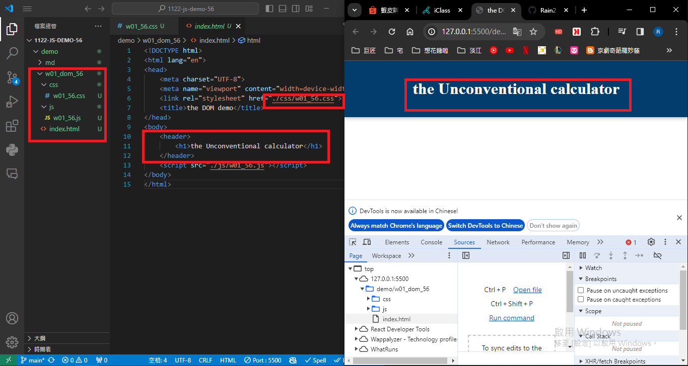

git config --global user.email "211410856@o365.tku.edu.com.tw"
git config --global user.name "Rain211410856"

Video: ### W01-P1: Show the w01-dom title
 

 
```

```

git log --pretty=format:"%h%x09%an%x09%ad%x09%s" --after="2024-02-20"
