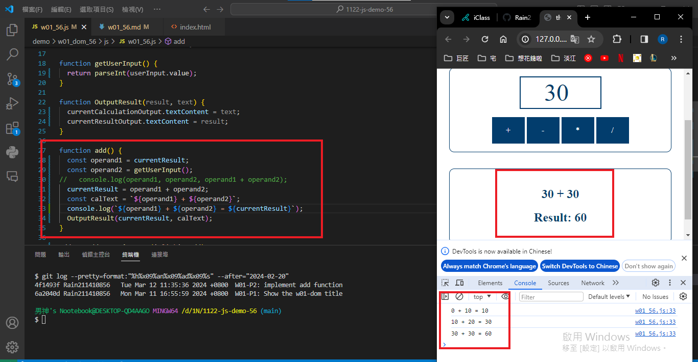

git config --global user.email "211410856@o365.tku.edu.com.tw"
git config --global user.name "Rain211410856"

### W01-P1: Show the w01-dom title
 

 
```
6a2040d Rain211410856   Mon Mar 11 16:55:59 2024 +0800  W01-P1: Show the w01-dom title
```

### W01-P2: implement add function
 

