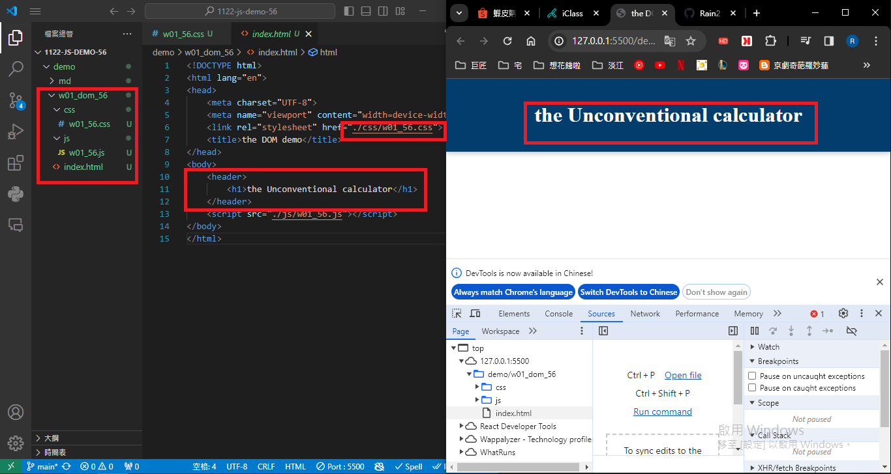
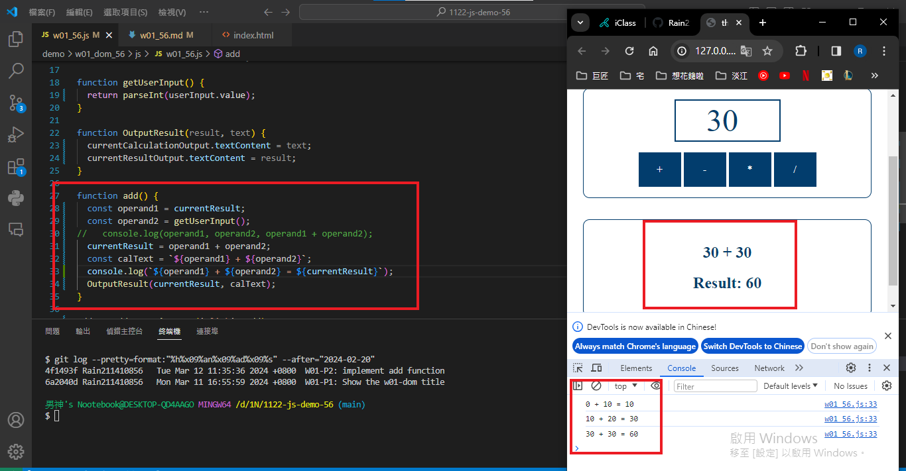
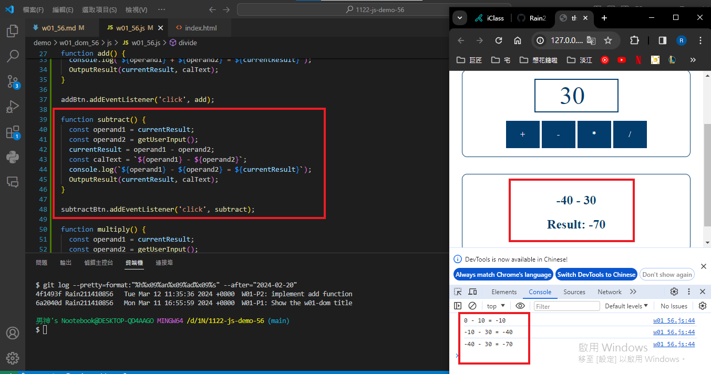
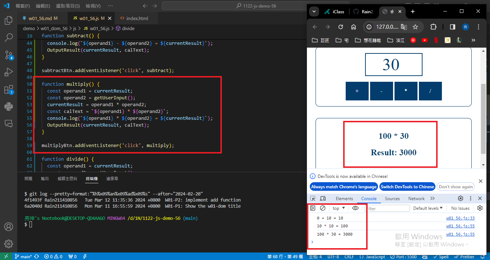
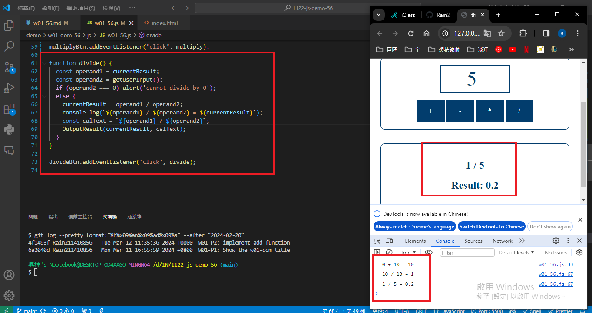

git config --global user.email "211410856@o365.tku.edu.com.tw"
git config --global user.name "Rain211410856"

### W01-P1: Show the w01-dom title
 

 
```
6a2040d Rain211410856   Mon Mar 11 16:55:59 2024 +0800  W01-P1: Show the w01-dom title
```

### W01-P2: implement add function
 


```
4f1493f Rain211410856   Tue Mar 12 11:35:36 2024 +0800  W01-P2: implement add function
```
### W01-P3: implement subtract function
 


### W01-P4: implement multiply function
 


### W01-P5: implement divide function
|


### W01-P6: git logs for W01

```
git log --pretty=format:"%h%x09%an%x09%ad%x09%s" --after="2024-02-20"

ca37e03 Rain211410856   Tue Mar 12 12:43:00 2024 +0800  W01-P6: git logs for W01
4f1493f Rain211410856   Tue Mar 12 11:35:36 2024 +0800  W01-P2: implement add function
6a2040d Rain211410856   Mon Mar 11 16:55:59 2024 +0800  W01-P1: Show the w01-dom title
```

