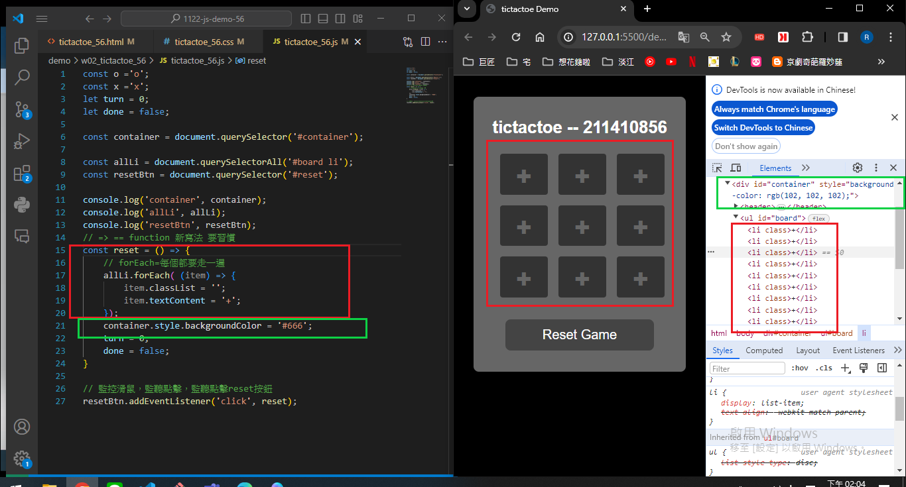
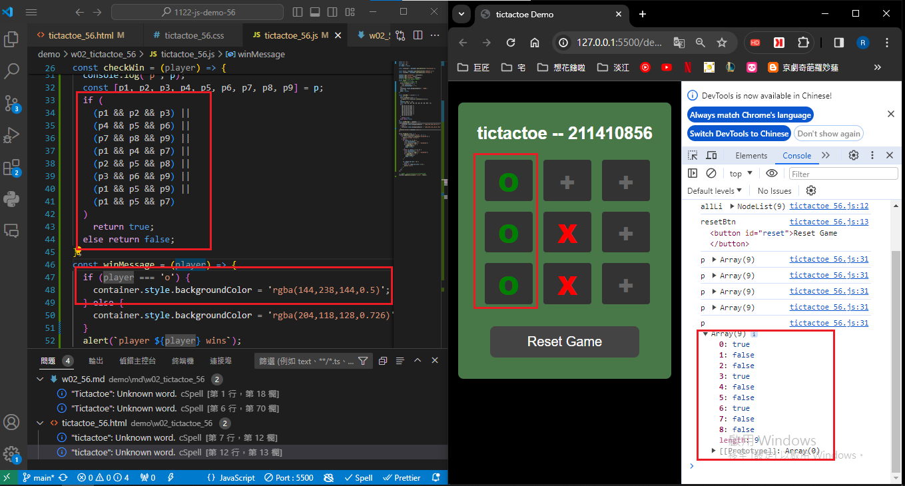
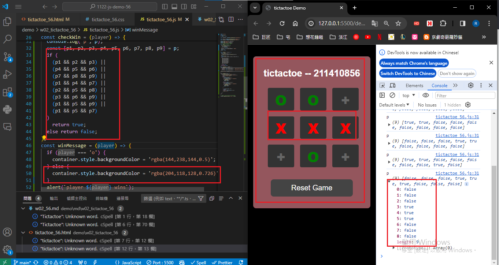
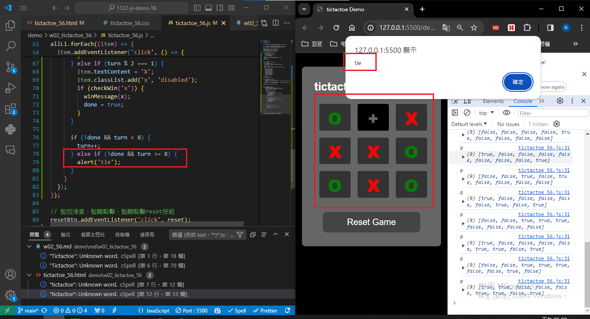

### W02-P1: Show Tictactoe css
 


```
159ffec Rain211410856   Tue Mar 12 16:22:22 2024 +0800  W02-P1: Show Tictactoe css
```

### W02-P2: implement reset button
 


```
54a40af Rain211410856   Wed Mar 13 14:07:53 2024 +0800  W02-P2: implement reset button
```
### W02-P3: implment checkWin(player), and winMessage(player)
 
#### => player O wins
 

 
#### => player X wins
 

 
#### => tie game
 

 
```
cf0f4e0 Rain211410856   Wed Mar 13 17:03:24 2024 +0800  W02-P3: implment checkWin(player), and winMessage(player)
```

### W01-P4: git logs for W02
```
$ git log --pretty=format:"%h%x09%an%x09%ad%x09%s" --after="2024-02-28"
cf0f4e0 Rain211410856   Wed Mar 13 17:03:24 2024 +0800  W02-P3: implment checkWin(player), and winMessage(player)
54a40af Rain211410856   Wed Mar 13 14:07:53 2024 +0800  W02-P2: implement reset button
b540175 Rain211410856   Tue Mar 12 16:54:11 2024 +0800  repush
159ffec Rain211410856   Tue Mar 12 16:22:22 2024 +0800  W02-P1: Show Tictactoe css
```
git log --pretty=format:"%h%x09%an%x09%ad%x09%s" --after="2024-02-28"