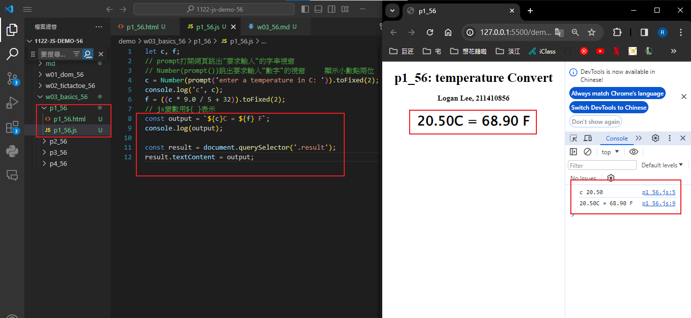
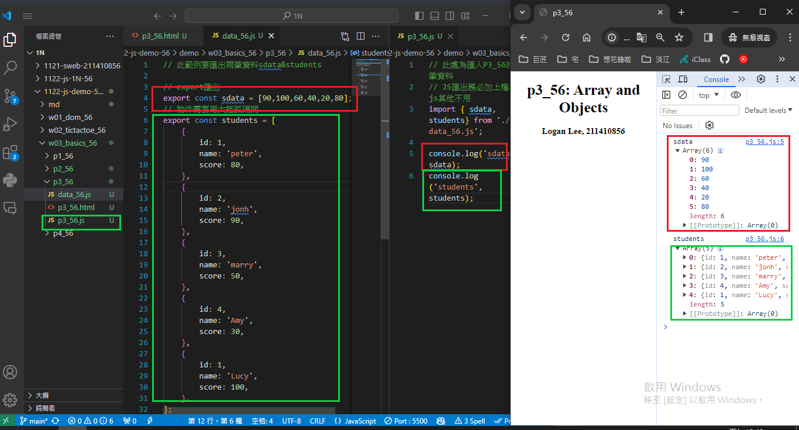
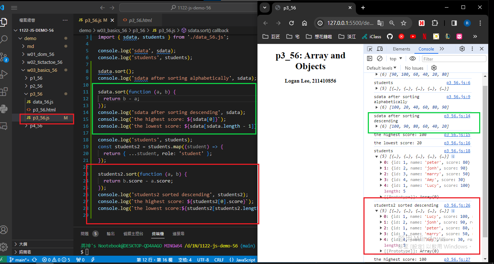

[My github URL](https://github.com/Rain211410856/1121-sweb-211410856)
[Vercel URL](https://1121-sweb-211410856.vercel.app/demo/w05_56_blog/)

### W03-P1: P1_xx temperature convert
 


```
5640d9a Rain211410856   Thu Mar 14 16:15:11 2024 +0800  W03-P1: P1_xx temperature convert
```
 ### W03-P3: import sdata and students data from data_xx.js
 


```
c32620f Rain211410856   Fri Mar 15 12:51:52 2024 +0800  W03-P3: import sdata and students data from data_xx.js
```

## W03-P4: Compute highest and lowest score of sdata and students2
 

 
 ```

 ```

git log --pretty=format:"%h%x09%an%x09%ad%x09%s" --after="2024-03-07"