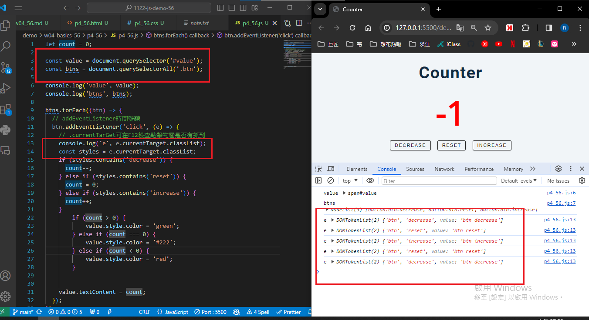
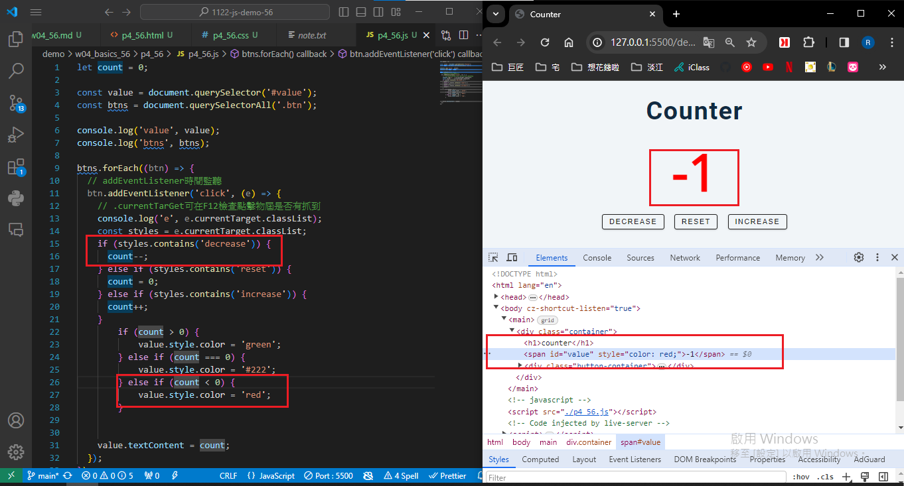
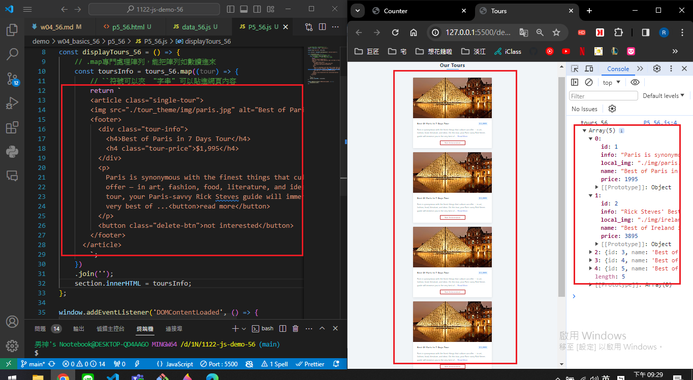
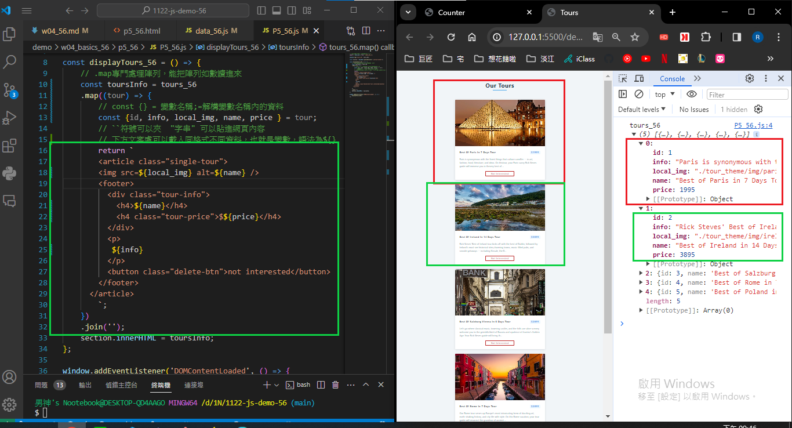
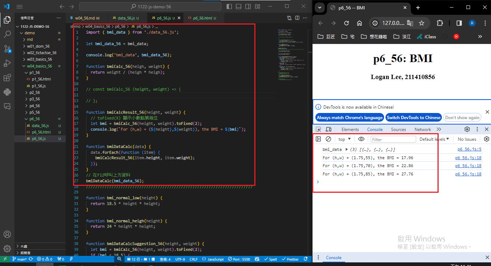
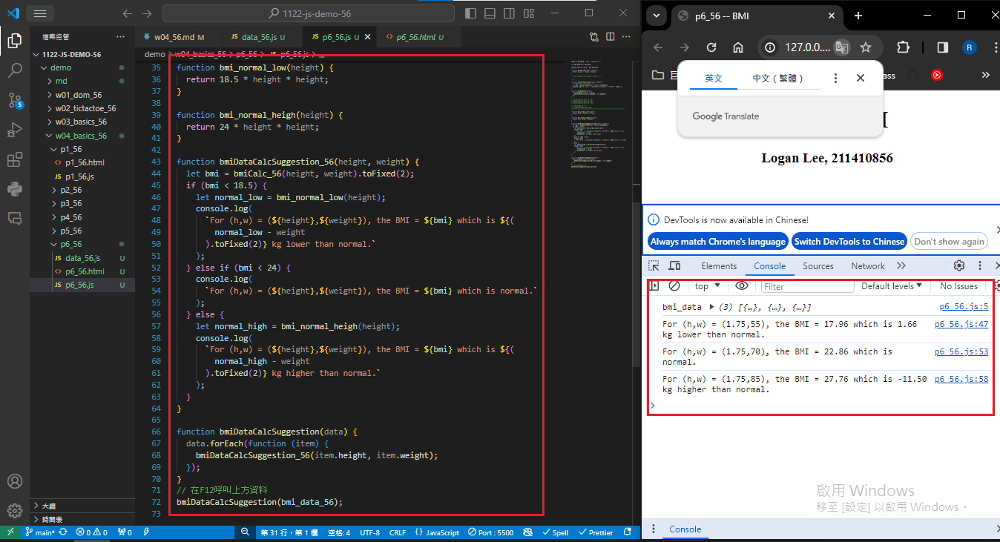

[My github URL](https://github.com/Rain211410856/1121-sweb-211410856)
[Vercel URL](https://1121-sweb-211410856.vercel.app/demo/w05_56_blog/)

### W04-P1: P4_xx -- Counter Demo
 

 


```
6db0dac Rain211410856   Sun Mar 17 20:01:03 2024 +0800  W04-P1: P4_xx -- Counter Demo
```
### W04-P2: P5_xx -- Tours display two fixed data
 


```
734dea6 Rain211410856   Sun Mar 17 21:32:08 2024 +0800  W04-P2: P5_xx -- Tours display two fixed data
```

### W04-P3: P5_xx -- Display 5 tours from data_xx.js (json array)
 


```
c21e373 Rain211410856   Sun Mar 17 21:50:40 2024 +0800  W04-P3: P5_xx -- Display 5 tours from data_xx.js (json array)
```

## W04-P4: P6_xx -- BMI Compute with Suggestion
 
#### => bmiDataCalc(bmi_data_xx);
 

 
#### => bmiDataCalcSuggestion(bmi_data_xx);
 


```

```
git log --pretty=format:"%h%x09%an%x09%ad%x09%s" --after="2024-03-13"