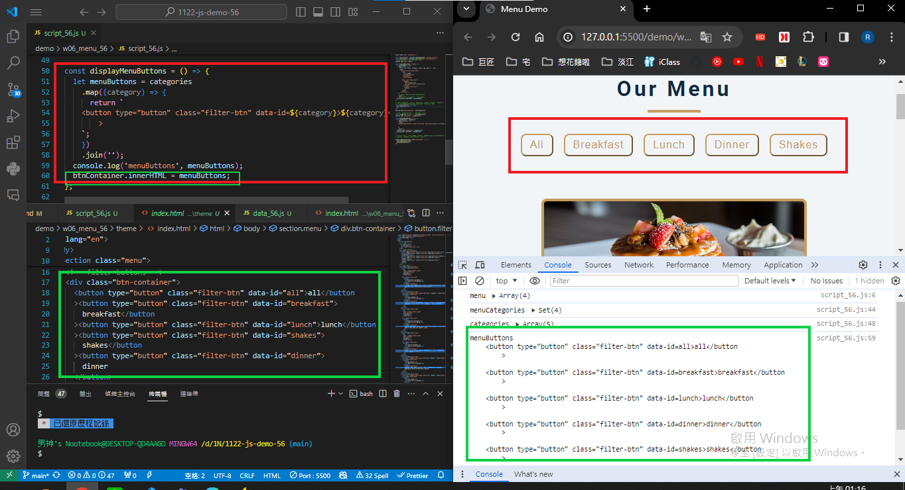

[My github URL](https://github.com/Rain211410856/1122-js-demo-56)
[Vercel URL](https://1122-js-demo-56.vercel.app/)

W06-P1: Create categories dynamically from data_xx.js
 

 
```
7c247ef Rain211410856   Fri Mar 29 18:56:40 2024 +0800  W06-P1: Create categories dynamically from data_xx.js
```
### W06-P2: Display Menu buttons from categories array
 


```
a12ebcf Rain211410856   Sat Mar 30 01:22:56 2024 +0800  W06-P2: Display Menu buttons from categories array
```

### W06-P3: implement filter buttons
 
#### => choose breakfast
 

 
#### => choose shakes
 

 
#### => choose all
 

 
```
 c4ed848 Rain211410856   Sat Mar 30 02:26:26 2024 +0800  W06-P3: implement filter buttons
```
### W06-P4: implement open modals
 

 
```
f2e9f9a htchung Thu Mar 28 21:27:00 2024 +0800  W06-P4: implement open modals
```
 
---
 
### W06-P5: implement close modals
 


W06-P6: git logs for W6

```
it log --pretty=format:"%h%x09%an%x09%ad%x09%s" --after="2024-03-27"
71dd876 Rain211410856   Sat Mar 30 03:26:38 2024 +0800  W06-P4: implement open modals
c4ed848 Rain211410856   Sat Mar 30 02:26:26 2024 +0800  W06-P3: implement filter buttons
a12ebcf Rain211410856   Sat Mar 30 01:22:56 2024 +0800  W06-P2: Display Menu buttons from categories array
7c247ef Rain211410856   Fri Mar 29 18:56:40 2024 +0800  W06-P1: Create categories dynamically from data_xx.js
```


