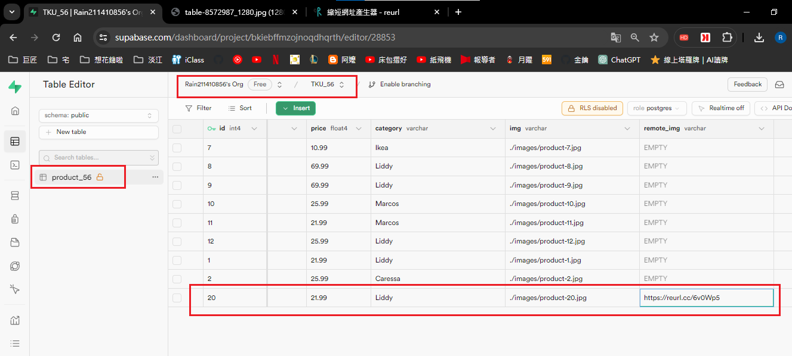
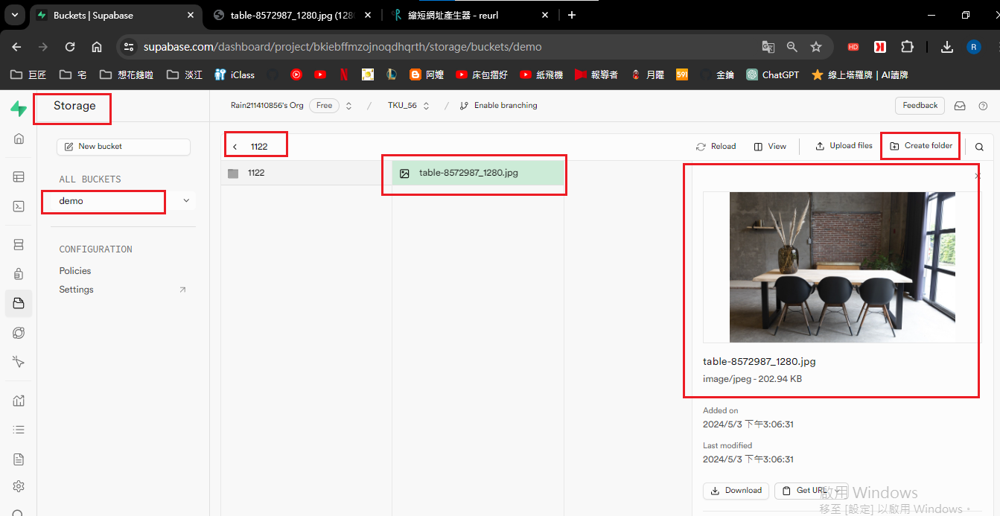

[My github URL](https://github.com/Rain211410856/1122-js-demo-56)
[Vercel URL](https://1122-js-demo-56.vercel.app/)

### W10-P1: In Supabase, create product_xx table with 8 product data


```
2e8aad8 Rain211410856   Fri May 3 14:25:17 2024 +0800   W10-P1: In Supabase, create product_xx table with 8 product data
```

### W10-P2: Get a photo from unsplash, and put it into storage in Supabase







git log --pretty=format:"%h%x09%an%x09%ad%x09%s" --after="2024-04-25"